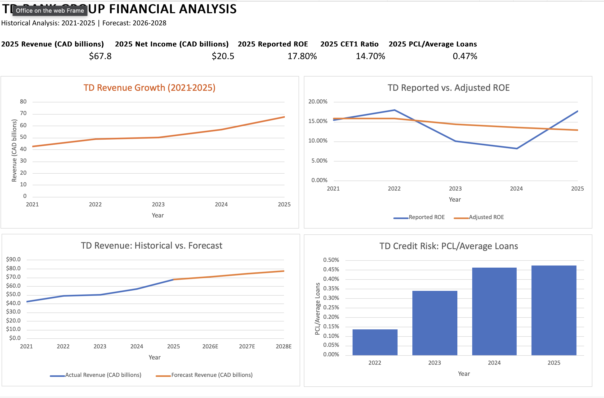

# TD Bank Group Financial Analysis & Forecasting Model
## Overview
This project analyses TD Bank Group's financial performance from 2021 to 2025 and develops a base-case financial forecast for 2026 to 2028.
The analysis was built in Microsoft Excel using financial data from TD Bank Group's annual reports. The project examines historical growth, profitability, operating performance, credit risk, capital adequacy, and valuation, while using historical trends and analyst assumptions to develop a forward-looking financial forecast.

## Project File

[Download the Excel Financial Model](TD_Bank_Group_Financial_Analysis.xlsx)

## Dashboard Preview

## Analysis Performed

### Growth Analysis
- Calculated historical revenue, net income, diluted EPS, loans, deposits, assets, and dividend growth.
- Calculated compound annual growth rates (CAGR) to evaluate long-term financial trends.

### Profitability Analysis
- Analyzed Return on Assets (ROA) and both reported and adjusted Return on Equity (ROE).
- Compared reported and adjusted ROE to distinguish overall reported performance from underlying operating trends.

### Operating & Credit Analysis
- Evaluated, reported and adjusted efficiency ratios to assess operating performance.
- Analyzed Provision for Credit Losses (PCL) as a percentage of average loans to assess changes in credit risk.

### Capital & Valuation Analysis
- Analyzed the CET1 ratio to evaluate TD's capital position.
- Evaluated historical book value per share, share price, Price-to-Book (P/B), and Price-to-Earnings (P/E) ratios.

## Financial Forecast

A base-case financial forecast was developed for 2026–2028 using historical performance and the author's assumptions.

Key forecast drivers include:
- Revenue growth
- Loan growth
- Deposit growth
- PCL as a percentage of average loans
- Non-interest expense growth
- Effective tax rate

The model projects revenue, loans, deposits, average loans, provisions for credit losses, non-interest expenses, pre-tax income, income taxes, and net income.

## Scenario Analysis

A simplified revenue sensitivity analysis was developed using three hypothetical scenarios:

- **Bear Case:** 3% annual revenue growth
- **Base Case:** 5% annual revenue growth
- **Bull Case:** 7% annual revenue growth

These scenarios illustrate how different sustained revenue growth assumptions could affect TD Bank Group's future revenue trajectory.

## Key Findings

- **Revenue Growth:** TD's reported revenue increased from $42.7B CAD in 2021 to $67.8B in 2025, representing a 12.3% CAGR.

- **Profitability:** Reported ROE was volatile over the period, while adjusted ROE declined from 15.9% in 2021 to 12.9% in 2025, showing a more consistent downward trend in underlying profitability.

- **Credit Risk:** PCL as a percentage of average loans increased from 0.14% in 2022 to 0.47% in 2025, although the increase moderated considerably between 2024 and 2025.

- **Forecast:** Under the base-case assumptions, revenue is forecast to increase from $67.8B in 2025 to approximately $77.3B by 2028, reflecting progressively moderating annual revenue growth assumptions.

- **Valuation:** TD's share price increased to $115.16M in 2025 from $89.64M in 2025, while its P/B ratio rose to 1.67 in 2025 from 1.29 in 2024, indicating a higher market valuation relative to book value. Its 2025 P/E ratio of 9.96 remained below its five-year average of 12.18.

## Skills Demonstrated

- Microsoft Excel
- Financial statement analysis
- Financial ratio analysis
- Financial forecasting
- Scenario and sensitivity analysis
- Data visualization and dashboard development
- CAGR and growth analysis
- Banking profitability, credit risk, capital, and valuation analysis

## Data Sources

Historical financial data was obtained from publicly available TD Bank Group annual reports covering fiscal years 2021–2025.

Historical figures reflect values reported in the respective fiscal-year reports and may differ from subsequently restated comparative figures.

All forward-looking estimates for 2026–2028 are illustrative analyst assumptions developed for this project and do not represent TD Bank Group guidance.

## Project Limitations

This project represents a simplified financial analysis and forecasting model developed for educational and portfolio purposes. The forecast does not constitute investment advice and does not incorporate all factors that could affect TD Bank Group's future financial performance.

## Methodology Note

This was my first time using Microsoft Excel and building a financial analysis. For full transparency, ChatGPT was used as an assistive tool in the development of this project.
